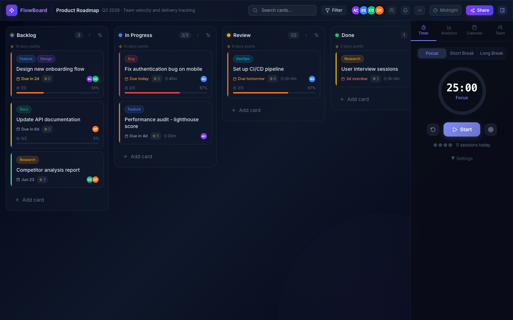
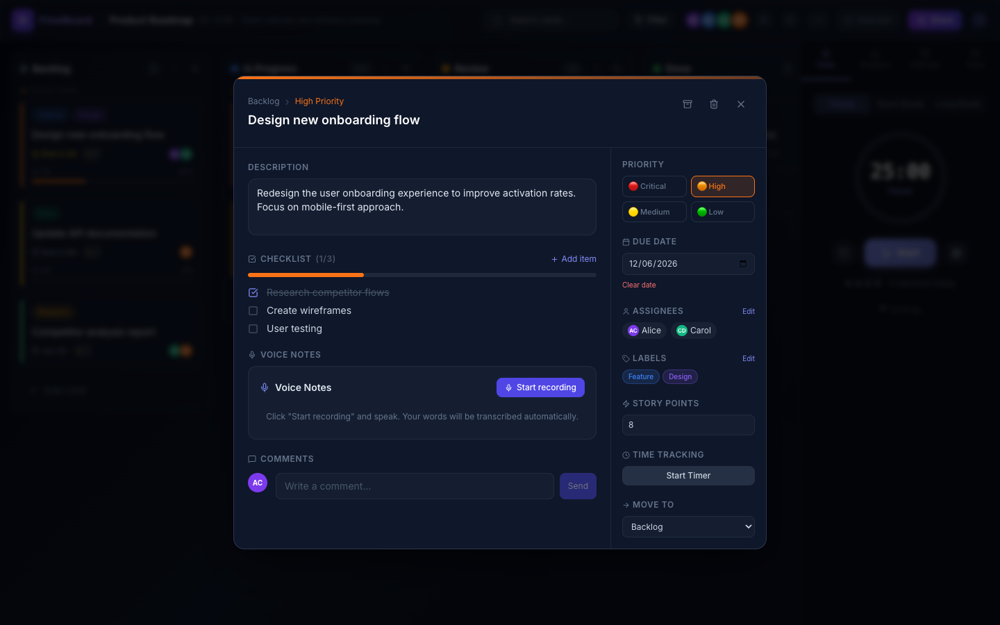
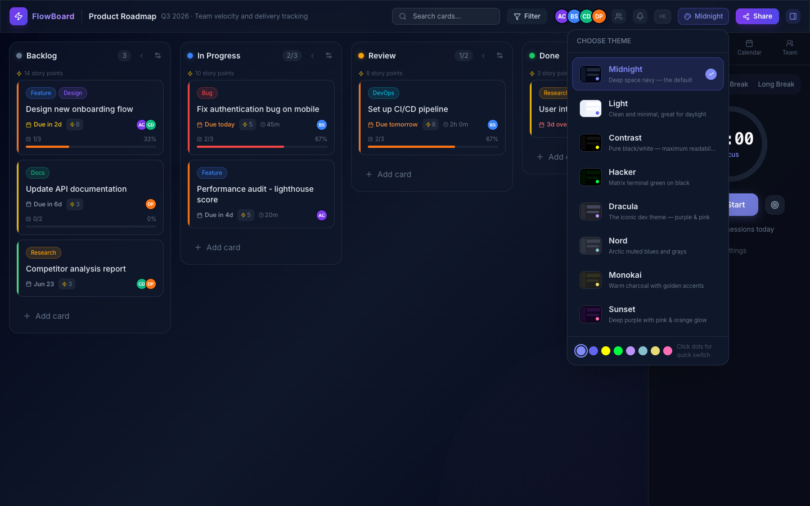
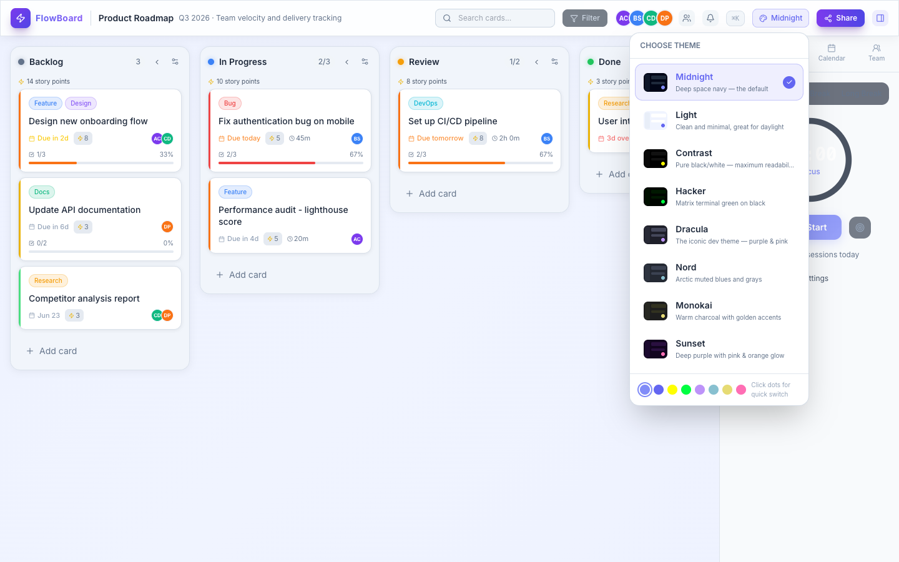
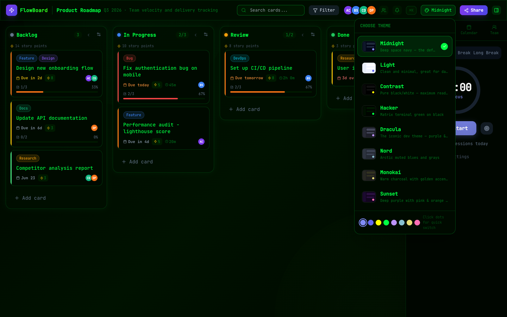

# FlowBoard — Kanban Project Manager

A full-featured, beautiful Kanban board built with React 18, TypeScript, and Tailwind CSS. Manage work visually with drag-and-drop columns, priority tracking, team collaboration, voice notes, analytics, and 8 hand-crafted themes.



---

## Features

### Core Board
- **Drag-and-drop** cards between columns and reorder columns themselves
- **WIP limits** — set a max card count per column; exceeded limits highlight in red
- **Collapsible columns** — collapse any column down to a slim vertical strip
- **Live search** — filter cards across all columns instantly
- **Multi-filter** — filter by priority, assignee, label, or overdue status simultaneously

### Cards
- **Priority levels** — Critical, High, Medium, Low with colour-coded left-border indicators
- **Subtask checklists** with progress bar and completion percentage
- **Due dates** with relative display ("Due in 2d", "Due today") and overdue pulsing badge
- **Story points** for effort estimation (shown per-card and totalled per-column)
- **Time tracking** — built-in timer to log time spent on each card
- **Labels** — colour-tagged labels for categorisation
- **Assignees** — assign multiple team members per card
- **Comments** — threaded comments with timestamps
- **Move to column** — quickly reassign a card to any column from the modal
- **Archive** — archive completed cards without deleting them



### Voice Notes
Record spoken notes directly on any card using the browser's built-in Web Speech API — no API key or microphone app required. Works natively in Chrome and Edge.

### Team Collaboration
- Add and manage team members with custom colours and initials
- Assign members to cards; see avatar stacks on the board
- Team view in the sidebar shows every member's active tasks and overdue count
- **Board sharing** — share the entire board state via a single URL (base64-encoded JSON — no backend needed)

### Productivity Tools

| Tool | Description |
|------|-------------|
| **Pomodoro Timer** | 25/5/15-min work and break cycles with auto-transitions and notification alerts |
| **Analytics** | Cards by priority, WIP per column, overdue counts, team workload charts |
| **Calendar View** | Monthly calendar showing all due dates at a glance |
| **Command Palette** | `⌘K` — search cards, jump to columns, create new cards, open sidebar views |
| **Deadline Notifications** | Browser push notifications for cards due today or overdue |

### 8 Themes

Switch themes live from the header — your choice persists across sessions.



| Theme | Description |
|-------|-------------|
| **Midnight** | Deep space navy — the default dark mode |
| **Light** | Clean white canvas, great for bright environments |
| **Contrast** | Pure black/white with yellow and cyan accents — maximum readability |
| **Hacker** | Matrix terminal green on black, switches to JetBrains Mono font |
| **Dracula** | The iconic dev theme — purple & pink on dark |
| **Nord** | Arctic muted blues and greys |
| **Monokai** | Warm charcoal with golden and green accents |
| **Sunset** | Deep purple with pink & orange glow |

| Light Theme | Hacker Theme |
|:-----------:|:------------:|
|  |  |

---

## Tech Stack

| Layer | Technology |
|-------|-----------|
| Framework | React 18 + TypeScript |
| Build tool | Vite |
| Styling | Tailwind CSS v3 + CSS custom properties |
| State | Zustand with `persist` middleware (localStorage) |
| Drag-and-drop | `@hello-pangea/dnd` |
| Icons | Lucide React |
| Toasts | react-hot-toast |
| Voice | Web Speech API (browser-native) |
| Notifications | Web Notifications API (browser-native) |

---

## Getting Started

### Prerequisites
- Node.js 18+
- npm or pnpm

### Install & Run

```bash
# Clone
git clone https://github.com/TheProtagonist07/flowboard-kanban.git
cd flowboard-kanban

# Install dependencies
npm install

# Start dev server
npm run dev
# → http://localhost:5174
```

### Build for Production

```bash
npm run build       # TypeScript check + Vite bundle → dist/
npm run preview     # Serve the built dist locally
```

---

## Project Structure

```
src/
├── components/
│   ├── Board.tsx          # DnD context, column layout
│   ├── Column.tsx         # Column header, WIP, collapse, add-card
│   ├── KanbanCard.tsx     # Card tile with priority bar, meta, assignees
│   ├── CardModal.tsx      # Full card detail: checklist, voice, comments
│   ├── Header.tsx         # Search, filter, members, theme picker, share
│   ├── Sidebar.tsx        # Tab container for sidebar panels
│   ├── PomodoroTimer.tsx  # Work/break timer with notifications
│   ├── Analytics.tsx      # Charts and board metrics
│   ├── CalendarView.tsx   # Monthly due-date calendar
│   ├── TeamView.tsx       # Team member task overview
│   ├── ThemePicker.tsx    # 8-theme live switcher with swatches
│   ├── CommandPalette.tsx # ⌘K fuzzy search / action launcher
│   ├── ShareModal.tsx     # Board share-link generator
│   └── VoiceInput.tsx     # Web Speech API recorder
├── store.ts               # Zustand store — all board state + actions
├── types.ts               # TypeScript interfaces
├── utils.ts               # Helpers: encode/decode, filters, dates, notifications
├── index.css              # 8 theme variable blocks + global styles
└── App.tsx                # Root layout, keyboard shortcuts, URL import
```

---

## Keyboard Shortcuts

| Shortcut | Action |
|----------|--------|
| `⌘K` / `Ctrl+K` | Open command palette |
| `Esc` | Close command palette / card modal / share modal |
| `Enter` (in add-card textarea) | Save new card |
| `↑↓` (in command palette) | Navigate results |

---

## Board Sharing

Click **Share** in the header to generate a shareable URL. The entire board state (columns, cards, members, labels) is base64-encoded into the URL query string — no server or account required. Anyone who opens the link gets a full copy of the board imported into their local state.

---

## License

MIT © [Shivam Chaurasia](https://github.com/TheProtagonist07)
